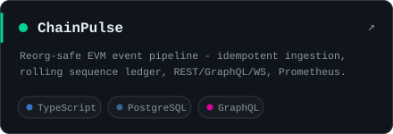
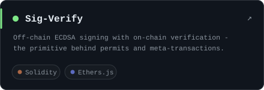
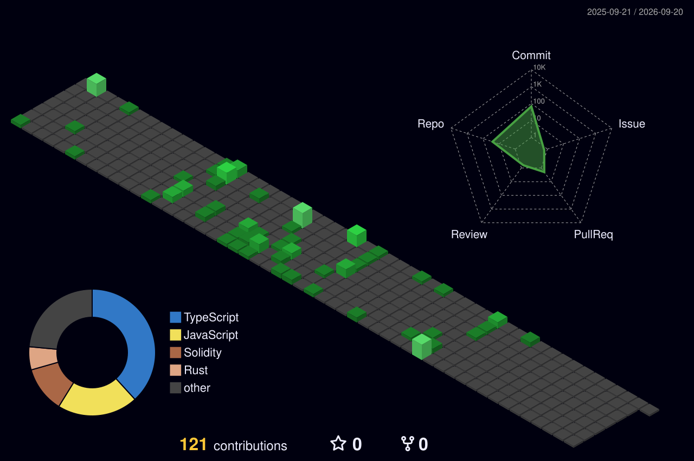

  <picture>
    <source media="(prefers-color-scheme: dark)" srcset="assets/hero-dark.svg">
    <source media="(prefers-color-scheme: light)" srcset="assets/hero-light.svg">
    
  </picture>

  <picture>
    <source media="(prefers-color-scheme: dark)" srcset="assets/portrait-dark.svg">
    <source media="(prefers-color-scheme: light)" srcset="assets/portrait-light.svg">
    
  </picture>

  <samp>
    <a href="mailto:anandsingh887472@gmail.com">email</a> &nbsp;·&nbsp;
    <a href="https://linkedin.com/in/anand-pratap707">linkedin</a> &nbsp;·&nbsp;
    <a href="https://p2p.me">p2p.me</a> &nbsp;·&nbsp;
    
  </samp>

## <samp>$ whoami</samp>

I engineer the systems where **money moves** — smart contracts on one end, distributed backends on the other, and the unforgiving middle where correctness actually matters: exactly-once semantics, reorg safety, idempotency, gas.

Right now I'm at **[P2P.me](https://p2p.me)**, building open payment rails that settle **USDC ↔ fiat** over UPI, PIX and QRIS. And I'm leveling up in **Rust**.

## <samp>$ ls ~/building</samp>

<table>
  <tr>
    <td>
      <a href="https://github.com/anandsingh07/semanticcache">
        <picture>
          <source media="(prefers-color-scheme: dark)" srcset="assets/cards/semanticcache-dark.svg">
          <source media="(prefers-color-scheme: light)" srcset="assets/cards/semanticcache-light.svg">
          
        </picture>
      </a>
    </td>
    <td>
      <a href="https://github.com/anandsingh07/cross-chain-indexer">
        <picture>
          <source media="(prefers-color-scheme: dark)" srcset="assets/cards/chainpulse-dark.svg">
          <source media="(prefers-color-scheme: light)" srcset="assets/cards/chainpulse-light.svg">
          
        </picture>
      </a>
    </td>
  </tr>
  <tr>
    <td>
      <a href="https://github.com/anandsingh07/cronHive">
        <picture>
          <source media="(prefers-color-scheme: dark)" srcset="assets/cards/cronhive-dark.svg">
          <source media="(prefers-color-scheme: light)" srcset="assets/cards/cronhive-light.svg">
          
        </picture>
      </a>
    </td>
    <td>
      <a href="https://github.com/anandsingh07/NexusPAY">
        <picture>
          <source media="(prefers-color-scheme: dark)" srcset="assets/cards/nexuspay-dark.svg">
          <source media="(prefers-color-scheme: light)" srcset="assets/cards/nexuspay-light.svg">
          
        </picture>
      </a>
    </td>
  </tr>
  <tr>
    <td>
      <a href="https://github.com/anandsingh07/-p2p-merchant-terminal">
        <picture>
          <source media="(prefers-color-scheme: dark)" srcset="assets/cards/terminal-dark.svg">
          <source media="(prefers-color-scheme: light)" srcset="assets/cards/terminal-light.svg">
          
        </picture>
      </a>
    </td>
    <td>
      <a href="https://github.com/anandsingh07/ethereum-offchain-signature-verification">
        <picture>
          <source media="(prefers-color-scheme: dark)" srcset="assets/cards/sigverify-dark.svg">
          <source media="(prefers-color-scheme: light)" srcset="assets/cards/sigverify-light.svg">
          
        </picture>
      </a>
    </td>
  </tr>
</table>

## <samp>$ cat ~/stack</samp>

  <picture>
    <source media="(prefers-color-scheme: dark)" srcset="assets/stack-dark.svg">
    <source media="(prefers-color-scheme: light)" srcset="assets/stack-light.svg">
    
  </picture>

## <samp>$ git log --graph</samp>

  <picture>
    <source media="(prefers-color-scheme: dark)" srcset="profile-3d-contrib/profile-night-green.svg">
    <source media="(prefers-color-scheme: light)" srcset="profile-3d-contrib/profile-green-animate.svg">
    
  </picture>

  <picture>
    <source media="(prefers-color-scheme: dark)" srcset="https://github-readme-stats.vercel.app/api?username=anandsingh07&show_icons=true&hide_border=true&bg_color=00000000&title_color=4D8DFF&icon_color=00D395&text_color=8B949E&ring_color=00D395&hide_title=true">
    <source media="(prefers-color-scheme: light)" srcset="https://github-readme-stats.vercel.app/api?username=anandsingh07&show_icons=true&hide_border=true&bg_color=00000000&title_color=0052FF&icon_color=0E8A6D&text_color=57606A&ring_color=0E8A6D&hide_title=true">
    
  </picture>
  <picture>
    <source media="(prefers-color-scheme: dark)" srcset="https://streak-stats.demolab.com/?user=anandsingh07&hide_border=true&background=00000000&ring=00D395&fire=4D8DFF&currStreakNum=E6EDF3&sideNums=E6EDF3&currStreakLabel=4D8DFF&sideLabels=8B949E&dates=8B949E">
    <source media="(prefers-color-scheme: light)" srcset="https://streak-stats.demolab.com/?user=anandsingh07&hide_border=true&background=00000000&ring=0E8A6D&fire=0052FF&currStreakNum=1F2328&sideNums=1F2328&currStreakLabel=0052FF&sideLabels=57606A&dates=57606A">
    
  </picture>

  <picture>
    <source media="(prefers-color-scheme: dark)" srcset="https://raw.githubusercontent.com/anandsingh07/anandsingh07/output/github-contribution-grid-snake-dark.svg">
    
  </picture>

---

  <samp>$ echo "web2 reliability &times; web3 trustlessness"</samp>

