  

  

  <samp>
    <a href="mailto:anandsingh887472@gmail.com">email</a> &nbsp;·&nbsp;
    <a href="https://linkedin.com/in/anand-pratap707">linkedin</a> &nbsp;·&nbsp;
    
  </samp>

## <samp>$ whoami</samp>

I'm a software engineer who builds **backend systems** — the services, data layers and APIs that hold up under real traffic. My day-to-day is **TypeScript and Node.js** over **Postgres and Redis**: idempotent jobs, clean data models, caching that actually pays off.

I also write **smart contracts** in Solidity when a problem calls for on-chain guarantees, and I'm leveling up in **Rust**. Web2 reliability, with web3 in the toolkit when it earns its place.

## <samp>$ ls ~/building</samp>

<table>
  <tr>
    <td>
      
    </td>
    <td>
      
    </td>
  </tr>
  <tr>
    <td>
      
    </td>
    <td>
      
    </td>
  </tr>
  <tr>
    <td>
      
    </td>
    <td>
      
    </td>
  </tr>
</table>

## <samp>$ cat ~/stack</samp>

  

## <samp>$ git log --graph</samp>

  

  
  

  

---

  <samp>$ echo "build systems that hold up &mdash; web2 first, web3 when it earns it"</samp>

